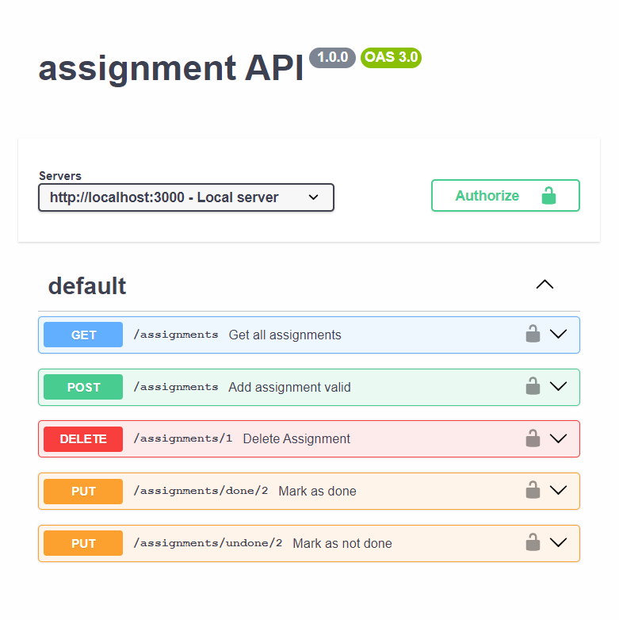

Lab 03 Req

## how to run this software
### on windows
1. `pip install virtualenv` — This command needs administrator privileges
2. `virtualenv venv`
3. `pip install Flask`
4. `python main.py`

[Postman collection](https://www.postman.com/altimetry-geoscientist-50523144/workspace/swe/collection/29666009-d16b931a-b54f-41b2-9648-162943564954?action=share&creator=29666009)